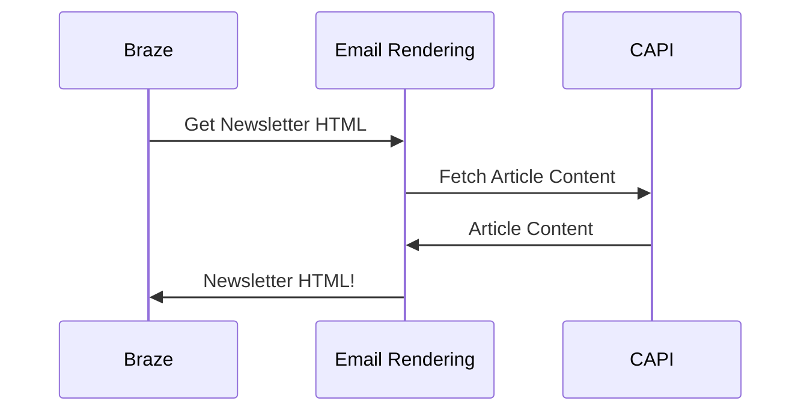
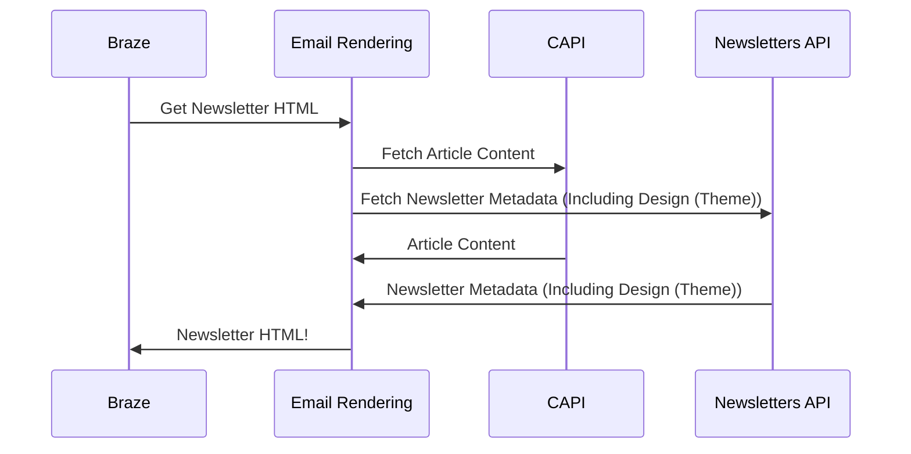

# Newsletters Dataflow 

## Current Dataflow

In the current implementation, the templates are hard-codeed in the email rendering project. Changes to designs or other metadata require a change to & release of that project.

## New Dataflow

The above implementation replaces the hard coded templates with a call to the Newsletters API which allows dynamic changes to newsletter design elements, driven by changes in the Tool user interface. 

## Tasks

* Update model in tool to decribe any metadata elements used in email rendering but not in the tool - Small ( coupls of hours)
* Update Email rendering make call to Newsletter API to retrieve any newsletter specific Metadata - Large
    [There are several sub-tasks in here] - There could be an initial step where we replace all the overlap in the metadata
    * - Clarify what the identifiers are here - Are we mapping a series tag to a template? (1-2 weeks)
* Update Email Rendering to fall back to a default set of styles where not metadata available for a given newsletter - Large
* Implement basic set of designs in email rendering - Medium (Dependency on design - maybe a weeks work - we have a lot of existing work to draw upon) (Large - 1 - 2 weeks)
* Expose Design Selection in the Tools UI - Medium (4 - 5 days)
* Explore and implement the selection of basic template to existing newsletters (Email rendering types no using basic template) - Large (2 - 3 weeks)
* Drive `LinkedList` behaviour through metadata (maybe a nice-to-have) - at present this is hard-code in email rendering. This is a limiter of design choice. We might be able to circumvent this with a common linked list component in email rendering an then campuring the `trigger` sub-heading in the Newletter metadata (spike / discussion)

